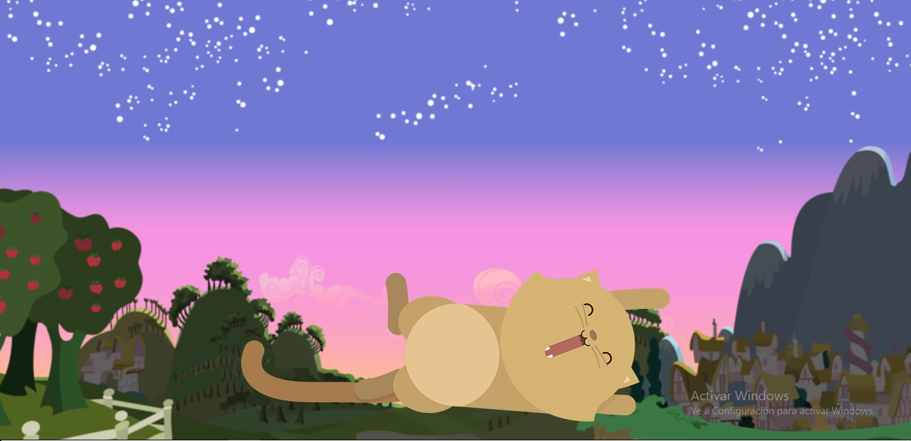
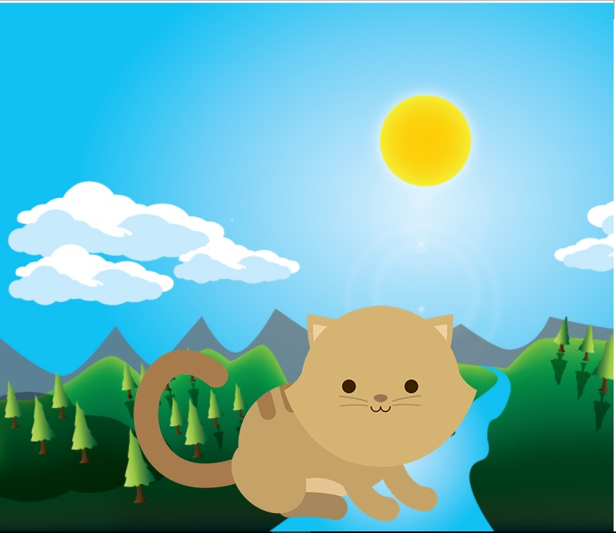
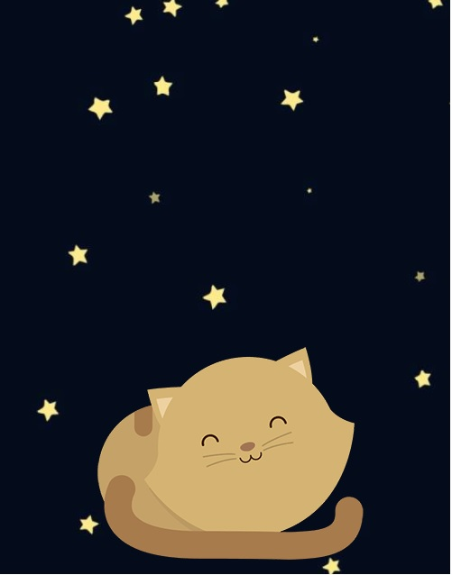

# Reto 1: Kitten
*  **Curso**: Responsive web Design
*  **Unidad 1**: La web desde el móvil
## OBJETIVO
* Crea una página web donde se muestre un paisaje y un gatito diferente a medida que la ventana del navegador se haga más pequeña.
## Herramientas
* HTML 5
* CSS 3
## PRODUCTO FINAL

***

***
